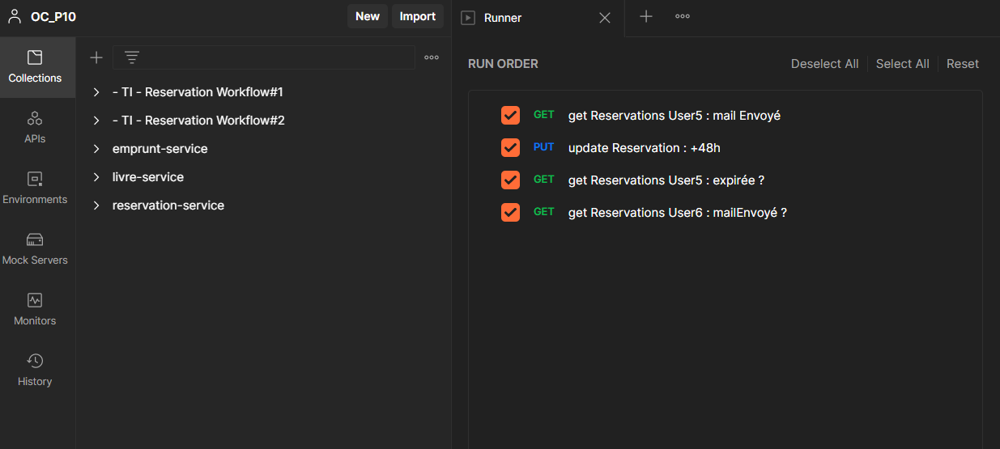

# OpenClassrooms Projet 10 - Developpeur d'Application Java #

## Améliorez le système d’information de la bibliothèque ##

### Ticket 3 ###

Après un code review de la V1 je me suis rendu compte que des tests unitaires n’ont pas été implémentés, on est donc hors des process de qualité sur cette release....
Pour la release qui est en cours de développement, merci de mettre en place une stratégie de tests pour le code API :
1. Des tests unitaires pour valider les parties métiers du code API (l’utilisation de JUnit devrait faire l’affaire, à vous de voir s’il y a besoin de faire des mocks ou non)
2. Des tests d’intégration de l’API via un outil de tests d’API (ex : Postman, Soap-UI)
Pour les tests de l’application web et du batch, on verra dans un second temps. Je vous tiendrai au courant…

### 1- Tests Unitaires ###

+ ReservationService Tests : 

+ EmpruntService Tests : 

+ ClientUI Tests : concerne les Règles de Gestion des réservations

### 2- Tests d'Intégration ###

Une série de tests d'intégration automatisés est réalisée avec Postman.

Le workflow est le suivant : 

#### WorkFlow#1 ####

+ les 3 exemplaires du livre Shinning de la Bibliotheque du Carré d'Art sont empruntés afin d'ouvrir la possibilité de le réserver
+ 2 réservations sont crées pour ce livre pour 2 abonnés différents
+ un exemplaire est rendu à la bibliothèque : un mail est envoyé au premier utilisateur sur la liste d'attente

#### WorkFlow#2 ####

+ un update est effectué sur la réservation : la date d'envoi du mail est fixée au 20/09 => 
la date d'expiration de la réservation est dépassée
+ la reservation est notée expirée
+ un mail est envoyé à l'utilisateur suivant sur la liste d'attente

