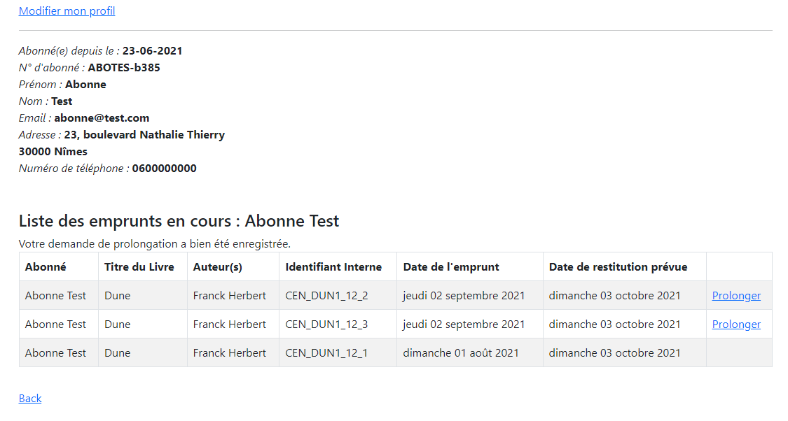

# OpenClassrooms Projet 10 - Developpeur d'Application Java #

## Améliorez le système d’information de la bibliothèque ##

### Ticket 2 ###

Nous avons découvert un bug de la gestion des prolongations de prêt. 

En effet, un usager peut prolonger un prêt après la date butoir. Il ne doit pas être possible pour l’usager de prolonger
un prêt si la date de fin de prêt est dépassée.

#### Exemple dans la version actuelle de l'application ####

La correction de cette anomalie est urgente car elle nous pose de gros problèmes de gestion. Actuellement beaucoup trop 
de personnes attendent le mail de rappel pour prolonger leur prêt. Cela entraîne la plainte de certains usagers à qui 
nous avions communiqué une date de retour et qui se déplacent en bibliothèque pour rien car le prêt a été prolongé a 
posteriori.

Je vous demande de livrer une nouvelle version de l’application au plus vite afin de corriger ce bug mais sans inclure 
nos autres demandes en cours. Nous souhaiterions pouvoir mettre en production rapidement sans avoir à faire de recette
sur les autres évolutions demandées.

## CORRECTION DU BUG ##

### Configuration de la base de données Postgres dans application.properties ###

+ configuration de la base de données (livre-service, utilisateur-service- emprunt-service) :

### Base de données ###

- les backup (structure et datas) pour la base de données sont dans le répertoire -docs/docs-ticket#/sql

- Créer une nouvelle base de données DB_P7_Bibliotheque dans pgAdmin : owner => POSTGRES

- Copier/Coller le contenu du fichier SQL_StructureFromP7.sql dans le QueryEditor et executer le script

- Copier/Coller le contenu du fichier SQL_DataFromP7.sql dans le QueryEditor et executer le script

### Utilisation et fonctionnalités ###

Page d'accueil accessible à : https://localhost:8999/ (gateway)

2 utilisateurs sont créés dans la base de données :
+ abonné : login : abonne@test.com / password : abonnetest
+ employé : login : employe@test.com/ password : employetest

Les nouveaux utilisateurs crées dans "s'inscrire" seront toujours des abonnés.

*Fonctionnalités d'un USER non connecté :*
+ s'inscrire / se connecter
+ effectuer une recherche
+ consulter le détail d'un livre

*Fonctionnalités d'un ABONNE connecté :*
+ consulter et modifier son profil
+ prolonger un emprunt

*Fonctionnalités d'un EMPLOYE connecté :*
+ enregistrer un emprunt
+ enregistrer un retour