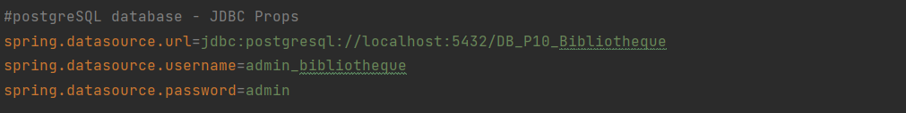
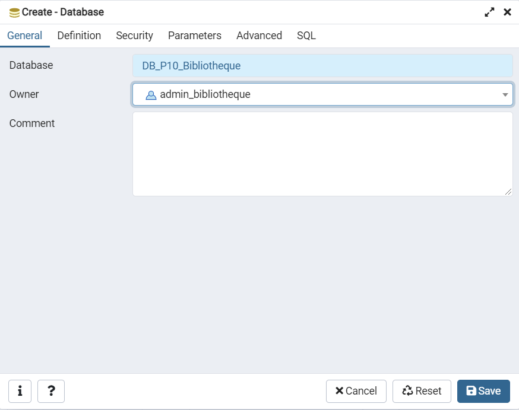
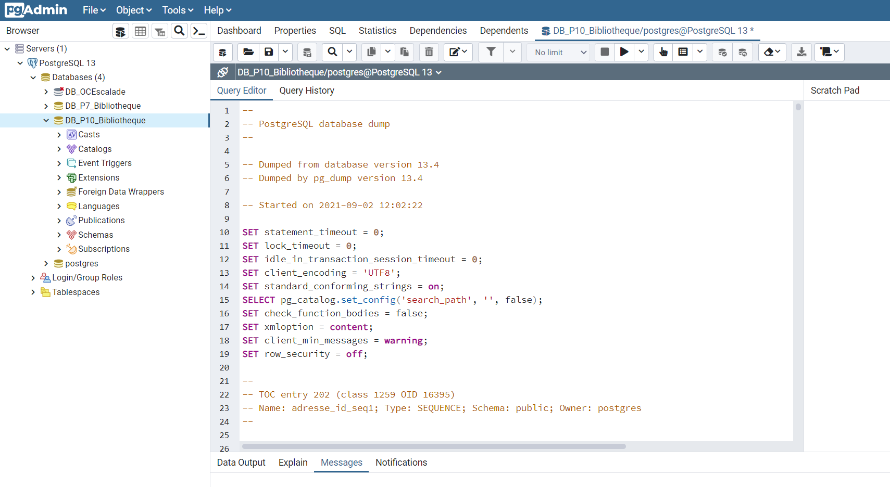
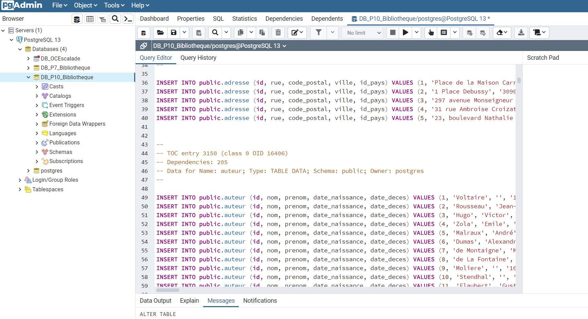

# OpenClassrooms Projet 10 - Developpeur d'Application Java

##Améliorez le système d’information de la bibliothèque


##Langages et Technologies utilisées :

+ Java / Html / Css

+ SpringBoot / Web / Jpa / Actuator / Lombok / DevTools

+ PostgreSQL

+ SpringSecurity

+ SpringCloud Gateway

+ SpringMail / SpringScheduler

+ Eureka

+ Feign

+ Thymeleaf / Bootstrap

##Documentation 

La documentation du projet pour les différents tickets se trouve dans le dossier "-docs" : 
+ ticket1 :
  + sql : scripts de création (structure et datas) de la base de données PostgreSQL (projet 7)
  et script de migration (cf modèle physique de données dans dossier infos)
  + documentation : Document de conception
    + enjeux et objectifs du ticket 1 
    + comparaison entre l'existant (Projet 7)
    et l'implémentation à réaliser
      (architecture du projet, diagrammes UML, arborescence du site, modèle physique de données)


##Modification de la configuration : application.properties


+ configuration de la base de données (livre-service, utilisateur-service- emprunt-service) :



## Base de données

- les backup pour la base de données sont dans le répertoire -docs/docs_ticket1/sql

- Créer une nouvelle base de données DB_P10_Bibliotheque dans pgAdmin

!

- Copier/Coller le contenu du fichier StructureFromP7.sql dans le QueryEditor et executer le script



- Copier/Coller le contenu du fichier DataFromP7WithUsersAndEmprunts.sql dans le QueryEditor et executer le script



A ce niveau, la base de données créée correspond à celle utilisé par la bibliothèque avant l'implémentation de
nouvelles fonctionnalités.

- Copier/Coller le contenu du fichier MigrationFromP7toP10.sql dans le QueryEditor et executer le script


Ce script ajoute les tables nécessaires à l'implémentation de la fonctionnalité demandée dans le premier ticket
(réservation d'ouvrages).

## Installation

IntelliJ = File -> New ->Project from Version Control

url : https://github.com/DocMcCoy30/OCprojet10.git

file : dossier de destination

ou

```
$ cd ../chemin/vers/le/dossier/de/destination
$ git clone https://github.com/DocMcCoy30/OCprojet10.git

$mvn install pour chaque service si nécessaire
```

## Demarrage des services

1- eureka-server

2- gateway-server

3- clientUI

4- utilisateur-service / livre-service / emprunt-service / reservation-service / email-service

5- imageserver contient les images (couvertures des livres notamment) : les infos pour l'installation et la configuration sont dans le ReadMe du module.

Pour chaque service
```
$ cd ../path/to/the/file/target
$ java -jar nom-du-service.jar
```

## Utilisation et fonctionnalités

Page d'accueil accessible à : https://localhost:8999/ (gateway)

2 utilisateurs sont créés dans la base de données :
+ abonné : login : abonne@test.com / password : abonnetest
+ employé : login : employe@test.com/ password : employetest

Les nouveaux utilisateurs crées dans "s'inscrire" seront toujours des abonnés.

###**Fonctionalités de base (projet 7)**

*Fonctionnalités d'un utilisateur non connecté :*
+ s'inscrire / se connecter
+ effectuer une recherche
+ consulter le détail d'un livre
+ 
*Fonctionnalités d'un abonné connecté :*
+ consulter et modifier son profil
+ prolonger un emprunt
+ 
*Fonctionnalités d'un employe connecté :*
+ enregistrer un emprunt
+ enregistrer un retour

*Fonctionnalités batch :*
+ controler les emprunts en cours
+ envoyer un mail de relance automatique

###**Ajout de fonctionnalités (projet 10 / ticket 1)**

*Fonctionnalités d'un abonne connecté :*
+ réserver un ouvrage
+ annuler une réservation
+ consulter ses réservations

*Fonctionnalités batch :*
+ controler les réservations
+ envoyer un mail d'information (retour d'un ouvrage réservé)