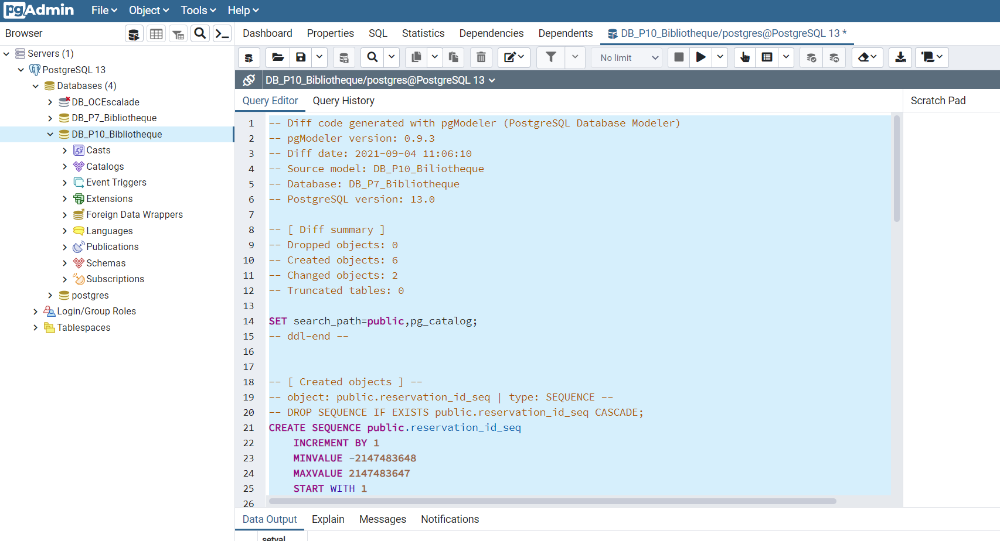

# OpenClassrooms Projet 10 - Developpeur d'Application Java #

## Améliorez le système d’information de la bibliothèque ##


### Langages et Technologies utilisées : ###

+ Java 11 / Html / Css
+ SpringBoot 2.5.3
+ SpringDoc / Actuator / Lombok / DevTools
+ PostgreSQL
+ SpringSecurity
+ SpringMail / SpringScheduler
+ Eureka
+ Feign
+ Thymeleaf / Bootstrap
+ Mapstruct

### Documentation ### 

La documentation du projet pour les différents tickets se trouve dans le dossier "-docs" : 
+ ticket1 :
  + sql : scripts de création (structure et datas) de la base de données PostgreSQL (projet 7)
  et script de migration (cf modèle physique de données dans dossier -docs/docs_ticket1/sql)
  + documentation : Document_de_Conception_P10_Ticket1.pdf (-docs/docs_ticket1/documentation)
    + enjeux et objectifs du ticket 1 
    + comparaison entre l'existant (Projet 7)
    et l'implémentation à réaliser
      (architecture du projet, diagrammes UML, arborescence du site, modèle physique de données)


### Modification de la configuration : application.properties ###

+ configuration de la base de données (livre-service, utilisateur-service, emprunt-service, reservation-service) :


### Base de données ###

- les backup pour la base de données sont dans le répertoire -docs/docs_ticket1/sql

- Créer une nouvelle base de données DB_P10_Bibliotheque dans pgAdmin

!

- Copier/Coller le contenu du fichier StructureFromP7.sql dans le QueryEditor et executer le script


- Copier/Coller le contenu du fichier MigrationFromP7toP10.sql dans le QueryEditor et executer le script



Ce script ajoute les tables nécessaires à l'implémentation de la fonctionnalité demandée dans le premier ticket
(réservation d'ouvrages).

- Copier/Coller le contenu du fichier DataFromP7WithUsersAndEmprunts.sql dans le QueryEditor et executer le script


### Installation ###

IntelliJ = File -> New ->Project from Version Control

url : https://github.com/DocMcCoy30/OCprojet10.git

file : dossier de destination

ou

```
$ cd ../chemin/vers/le/dossier/de/destination
$ git clone https://github.com/DocMcCoy30/OCprojet10.git

$mvn install pour chaque service si nécessaire
```

### Demarrage des services ###

1- imageserver contient les images (couvertures des livres notamment) : les infos pour l'installation et la configuration sont dans le ReadMe du module.

2- eureka-server

3- utilisateur-service / livre-service / emprunt-service / reservation-service 

4- clientUI / email-service

Pour chaque service
```
$ cd ../path/to/the/file/target
$ java -jar nom-du-service.jar
```

### Utilisation et fonctionnalités ###

Page d'accueil accessible à : https://localhost:9000/

Pour les besoins des tests des cas d'utilisation des nouvelles fonctionnalités, 8 utilisateurs sont créés dans 
la base de données (ainsi qu'un certain nombre de prêts et de réservations) :

Catégorie  | Login | Password
------------- | ------------- | -------------
Employé  | oss117@mail.com  | test123
Abonné  | comolet@mail.com  | test123
Abonné  | charpon@mail.com  | test123
Abonné  | leboissier@mail.com  | test123
Abonné  | delannoy@mail.com  | test123
Abonné  | labouse@mail.com  | test123
Abonné  | francard@mail.com  | test123
Abonné  | mongier@mail.com  | test123

Les nouveaux utilisateurs crées dans "s'inscrire" seront toujours des abonnés.

#### **Fonctionalités de base (projet 7)** ####

*Fonctionnalités d'un utilisateur non connecté :*
+ s'inscrire / se connecter
+ effectuer une recherche
+ consulter le détail d'un livre

*Fonctionnalités d'un abonné connecté :*
+ consulter et modifier son profil
+ prolonger un emprunt

*Fonctionnalités d'un employe connecté :*
+ enregistrer un emprunt
+ enregistrer un retour

*Fonctionnalités batch :*
+ controler les emprunts en cours
+ envoyer un mail de relance automatique

#### **Ajout de fonctionnalités (projet 10 / ticket 1)** ####

*Fonctionnalités d'un abonne connecté :*
+ réserver un ouvrage
+ annuler une réservation
+ consulter ses réservations

*Fonctionnalités batch :*
+ controler les réservations
+ envoyer un mail d'information (retour d'un ouvrage réservé)
